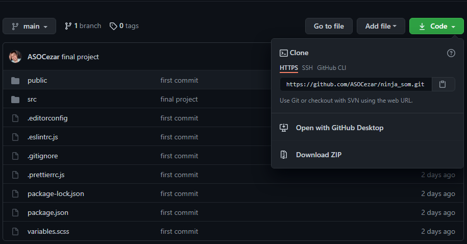
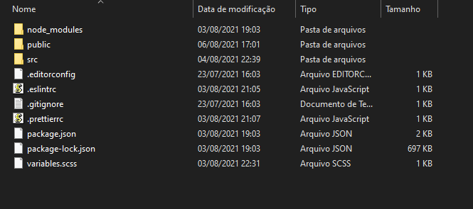
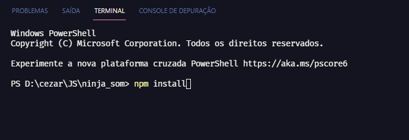
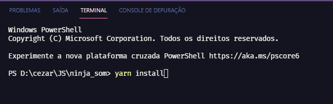
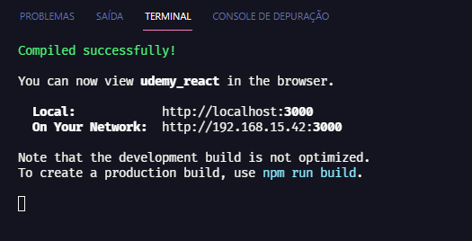
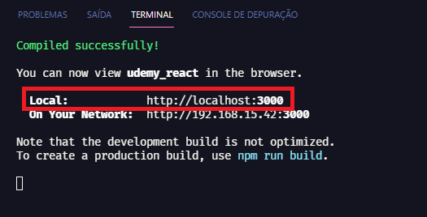

### Home Ninja Som 

### Como fazer um clone do projeto:

**1. Clique no ícone mostrado abaixo, na pasta principal do projeto e baixe a pasta do projeto no melhor formato para você**
 - O projeto pode ser baixado em zip ou através do comando "git clone + 'o endereço https do projeto'" no terminal da sua máquina (para isso, certifique-se de ter instalado o git).

------------

**2.  Após o download, abra a pasta raíz do projeto**

------------

**3. Em seu terminal, na pasta raíz do projeto, digite o comando "npm install" ou "yarn install" (de acordo com o gerenciador de pacotes que tiver instalado) e aguarde a instalação dos pacotes necessários**

------------

**4. Ao final da instalação de todos os pacotes necessários, dê o comando "npm start" ou "yarn start" (de acordo com o gerenciador de pacotes que tiver instalado) no terminal de seu editor e aguarde a finalização da criação do servidor**
- Deve ser aberta uma aba em seu navegador com o projeto em funcionamento. Caso não ocorra e essa mesma mensagem abaixo aparecer, você poderá acessar a página do projeto digitando o endereço presente no campo "Local" desta tela em seu navegador.

------------

**5. A tela principal deve ser parecida com essa (espero que gostem!! :)). Obrigado!!**

